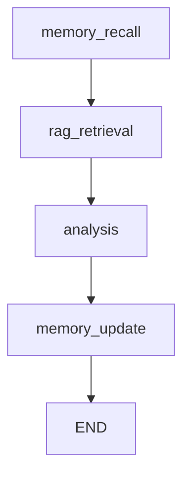
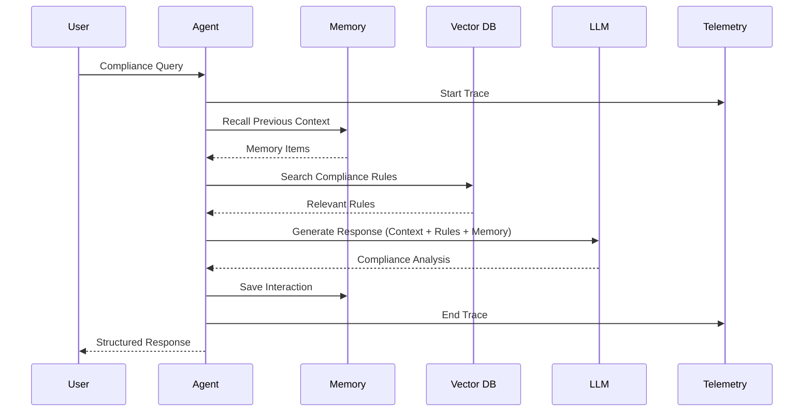

# NB2: RAG with Letta Memory - Complete Agentic System Documentation

## Table of Contents

1. [Overview](#overview)
2. [System Architecture](#system-architecture)
3. [Key Technologies](#key-technologies)
4. [Step-by-Step Breakdown](#step-by-step-breakdown)
5. [RAG Implementation](#rag-implementation)
6. [Letta Memory Integration](#letta-memory-integration)
7. [LangGraph Orchestration](#langgraph-orchestration)
8. [Telemetry and Observability](#telemetry-and-observability)
9. [Data Flows and Interactions](#data-flows-and-interactions)
10. [Setup Requirements](#setup-requirements)
11. [Integration Patterns](#integration-patterns)
12. [Production Considerations](#production-considerations)

## Overview

The **NB2_RAGwLetta.ipynb** notebook demonstrates a complete end-to-end AI agent workflow that combines multiple cutting-edge technologies to create a production-ready **portfolio compliance agent**. This system showcases how modern AI architectures can integrate RAG (Retrieval-Augmented Generation), persistent memory, workflow orchestration, and comprehensive observability.

### Main Purpose

The notebook builds a **portfolio compliance agent** that:

- **Retrieves relevant compliance rules** from a vector database using semantic search
- **Remembers previous conversations** and decisions using Letta memory system
- **Provides reasoned analysis** with full traceability and audit logs
- **Integrates with production backend systems** using FastAPI and proper APIs
- **Maintains full observability** through OpenTelemetry and LangSmith integration

### Use Case Scenario

The agent handles compliance queries like:
- "What are our sector concentration limits?"
- "Can we invest in BB-rated bonds?"
- "What ESG requirements must we meet?"
- "How can we use derivatives for hedging?"

Each query triggers a sophisticated workflow that combines retrieval, reasoning, and memory persistence.

## System Architecture

The notebook implements a **4-layer architecture**:

### 1. **Data Layer**
- **Qdrant Vector Database**: Stores compliance rules as semantic embeddings
- **Letta Memory Service**: Persists conversational context and agent learning
- **OpenAI Embeddings**: Converts text to high-dimensional vectors for semantic search

### 2. **Processing Layer**
- **LangGraph Workflow Engine**: Orchestrates multi-step agent processes
- **OpenAI Language Models**: Provides reasoning and response generation
- **RAG Pipeline**: Combines retrieval and generation for grounded responses

### 3. **Integration Layer**
- **FastAPI Backend**: Production-ready API endpoints and services
- **Pydantic Models**: Type-safe data validation and serialization
- **Environment Configuration**: Flexible deployment across different environments

### 4. **Observability Layer**
- **OpenTelemetry**: Distributed tracing across all components
- **LangSmith**: LLM-specific monitoring, evaluation, and debugging
- **Structured Logging**: Comprehensive audit trails and error reporting

## Key Technologies

### Core AI Technologies

1. **RAG (Retrieval-Augmented Generation)**
   - **Purpose**: Grounds AI responses in factual, up-to-date information
   - **Implementation**: Semantic search over compliance rules using vector embeddings
   - **Benefits**: Reduces hallucinations, provides source attribution, enables real-time knowledge updates

2. **Letta Memory System**
   - **Purpose**: Enables persistent conversational memory and agent learning
   - **Implementation**: HTTP-based API for storing and retrieving agent memories
   - **Benefits**: Cross-session context, improved user experience, agent personalization

3. **LangGraph Workflow Orchestration**
   - **Purpose**: Manages complex multi-step agent processes
   - **Implementation**: State-driven graph execution with checkpointing
   - **Benefits**: Reliable execution, error recovery, conversation continuity

### Supporting Technologies

4. **Qdrant Vector Database**
   - **Purpose**: High-performance vector storage and similarity search
   - **Implementation**: Docker-based deployment with REST API
   - **Benefits**: Sub-second search, horizontal scaling, production reliability

5. **OpenTelemetry + LangSmith**
   - **Purpose**: Comprehensive observability and monitoring
   - **Implementation**: Distributed tracing with span attributes and metrics
   - **Benefits**: Production debugging, performance optimization, audit compliance

6. **FastAPI Backend Integration**
   - **Purpose**: Production-ready API services and data models
   - **Implementation**: Modular architecture with Pydantic validation
   - **Benefits**: Type safety, auto-documentation, high performance

## Step-by-Step Breakdown

### Part 1: Environment Setup and Backend Integration (Cells 0-4)

**Purpose**: Establish the foundation for all subsequent components.

**Cell 0-1: Introduction**
- Provides overview of technologies and architecture
- Sets expectations for learning outcomes
- Defines the compliance agent use case

**Cell 2: Python Environment Setup**
```python
def add_src_to_path():
    """Locates and adds src/ directory to Python path"""
    # Searches project hierarchy for src/backend structure
    # Enables imports from backend modules
    # Provides clear error messages if not found
```

**Key Functions:**
- Dynamic path resolution for flexible project structure
- Environment variable loading from multiple possible locations
- Comprehensive error handling with informative messages

**Cell 3-4: Backend Module Imports**
```python
# RAG Components
from backend.app.tools.qdrant_admin import ensure_collection_edgar, search_dense_by_text
from backend.app.ingest.config import EMBED_MODEL, VECTOR_SIZE

# Memory System
from backend.app.memory import save, recall, health, list_agents
from backend.app.state import AppState

# Telemetry
from backend.app.telemetry import setup_telemetry
```

**Import Strategy:**
- Graceful degradation when components aren't available
- Feature flags to enable/disable functionality based on available services
- Clear status reporting for debugging and troubleshooting

### Part 2: Vector Database Setup (Cells 5-14)

**Purpose**: Create and populate the RAG knowledge base with compliance rules.

**Cell 5-6: Client Initialization**
```python
# OpenAI client for embeddings and completions
openai_client = OpenAI()  # Uses OPENAI_API_KEY

# Qdrant client for vector operations
qdrant_client = QdrantClient(
    url=os.getenv('QDRANT_URL', 'http://localhost:6333'),
    api_key=os.getenv('QDRANT_API_KEY'),
    timeout=30
)
```

**Configuration Details:**
- Environment-based configuration for deployment flexibility
- Proper timeout settings for production reliability
- Connection validation and error reporting

**Cell 7-8: Collection Creation**
```python
ensure_collection_edgar(
    client=qdrant_client,
    name=COLLECTION_NAME,
    vector_size=VECTOR_SIZE,  # Matches OpenAI embedding dimensions
    recreate=True  # Fresh start for demo purposes
)
```

**Collection Configuration:**
- **Vector Size**: 1536 dimensions (OpenAI text-embedding-ada-002)
- **Distance Metric**: Cosine similarity for semantic matching
- **Index Type**: HNSW for fast approximate search

**Cell 9-10: Compliance Rules Data**

The notebook includes 8 comprehensive compliance rules covering:

1. **Risk Management** (RISK-001, RISK-002)
   - Sector concentration limits (25% maximum)
   - Individual position limits (10% maximum)

2. **Liquidity Management** (LIQ-001)
   - Minimum cash reserves (5% requirement)

3. **Regulatory Compliance** (REG-001, REG-002)
   - ESG mandates (60% of equity holdings)
   - Geographic diversification (20-40% international)

4. **Credit Risk** (CREDIT-001)
   - Minimum investment grade ratings (BBB- or higher)

5. **Derivatives** (DERIV-001)
   - Usage limitations (15% maximum, hedging only)

6. **Reporting** (REPORT-001)
   - Monthly compliance reporting requirements

**Data Structure:**
```python
{
    "rule_id": "RISK-001",
    "category": "risk_management",
    "title": "Maximum Sector Concentration",
    "description": "No single sector allocation shall exceed 25%...",
    "severity": "high",
    "compliance_type": "concentration_limit"
}
```

**Cell 11-12: Vector Embedding and Upload**
```python
# Generate embeddings for semantic search
response = openai_client.embeddings.create(
    input=f"{rule['title']}: {rule['description']}",
    model=EMBED_MODEL  # text-embedding-ada-002
)

# Create Qdrant point with metadata
point = PointStruct(
    id=i + 1,
    vector=response.data[0].embedding,
    payload={**rule, "text": text_for_embedding, "ingested_at": timestamp}
)
```

**Embedding Strategy:**
- Combines title and description for richer semantic representation
- Includes comprehensive metadata for filtering and display
- Batch uploads for efficiency

**Cell 13-14: RAG Testing**
```python
def test_rag_search(query: str, limit: int = 3):
    """Tests semantic search functionality"""
    results = search_dense_by_text(
        client=qdrant_client,
        collection_name=COLLECTION_NAME,
        query_text=query,
        openai_client=openai_client,
        model=EMBED_MODEL,
        limit=limit
    )
```

**Test Queries:**
- "sector concentration limits" → Should find RISK-001
- "ESG sustainability requirements" → Should find REG-001
- "cash liquidity management" → Should find LIQ-001
- "credit rating requirements" → Should find CREDIT-001

### Part 3: Agent Memory with Letta Integration (Cells 15-18)

**Purpose**: Enable persistent conversational memory and context awareness.

**Cell 15-16: Memory System Initialization**
```python
# Initialize telemetry systems
tracer, langsmith_client = setup_telemetry()

# Check Letta memory service health
health_status = memory_health()
print(f"Letta available: {health_status.get('letta_available', False)}")
print(f"Service OK: {health_status.get('service_ok', False)}")
```

**Health Check Components:**
- **Letta Service Connectivity**: Verifies HTTP connection to memory service
- **Agent Listing**: Shows existing agents for debugging/monitoring
- **Configuration Validation**: Ensures proper environment setup

**Cell 17-18: Pydantic State Models**

**AgentConfig Model:**
```python
class AgentConfig(BaseModel):
    agent_id: str = Field(default_factory=lambda: f"compliance-agent-{uuid.uuid4().hex[:8]}")
    session_id: str = Field(default_factory=lambda: f"session-{uuid.uuid4().hex[:8]}")
    use_memory: bool = Field(default=True)
    use_rag: bool = Field(default=True)
    max_rag_results: int = Field(default=5)
    temperature: float = Field(default=0.1)
```

**ComplianceQuery Model:**
```python
class ComplianceQuery(BaseModel):
    query: str = Field(description="The user's compliance question")
    context: Optional[str] = Field(default=None)
    portfolio_data: Optional[Dict[str, Any]] = Field(default=None)
```

**ComplianceResponse Model:**
```python
class ComplianceResponse(BaseModel):
    answer: str = Field(description="The agent's response")
    relevant_rules: List[Dict[str, Any]] = Field(default_factory=list)
    confidence_score: float = Field(default=0.0)
    trace_id: Optional[str] = Field(default=None)
    memory_updated: bool = Field(default=False)
```

**ComplianceAgentState Model:**
- Extends backend `AppState` when available
- Includes all workflow state: config, query, retrieved_rules, memory_context, response
- Provides type safety and validation throughout the workflow

### Part 4: LangGraph Workflow Implementation (Cells 19-22)

**Purpose**: Orchestrate the complete agent process through a structured workflow.

**Cell 19-20: Workflow Nodes Implementation**

**1. Memory Recall Node:**
```python
def memory_recall_node(state: ComplianceAgentState) -> ComplianceAgentState:
    """Recalls relevant memories from previous conversations"""
    memories = recall(
        user_id=state.config.agent_id,
        query=state.query.query,
        k=3  # Top 3 most relevant memories
    )
    state.memory_context = [m.get('content', '') for m in memories]
```

**2. RAG Retrieval Node:**
```python
def rag_retrieval_node(state: ComplianceAgentState) -> ComplianceAgentState:
    """Retrieves relevant compliance rules using semantic search"""
    results = search_dense_by_text(
        client=qdrant_client,
        collection_name=COLLECTION_NAME,
        query_text=state.query.query,
        limit=state.config.max_rag_results
    )
    state.retrieved_rules = [r.payload for r in results]
```

**3. Analysis Node:**
```python
def analysis_node(state: ComplianceAgentState) -> ComplianceAgentState:
    """Generates response using LLM with retrieved context"""
    # Combines retrieved rules and memory context
    messages = [
        {"role": "system", "content": "You are a portfolio compliance expert..."},
        {"role": "user", "content": f"Context:\n{context}\n\nQuery: {query}"}
    ]

    response = openai_client.chat.completions.create(
        model="gpt-4o-mini",
        messages=messages,
        temperature=state.config.temperature
    )
```

**4. Memory Update Node:**
```python
def memory_update_node(state: ComplianceAgentState) -> ComplianceAgentState:
    """Saves the interaction to memory for future use"""
    memory_item = {
        "query": state.query.query,
        "response": state.response.answer,
        "timestamp": datetime.now().isoformat(),
        "rules_used": len(state.retrieved_rules),
        "confidence": state.response.confidence_score
    }
    save(user_id=state.config.agent_id, item=memory_item)
```

**Node Design Principles:**
- **Error Handling**: Each node includes try/catch blocks with graceful fallbacks
- **Telemetry**: OpenTelemetry spans track execution with attributes
- **State Management**: Pure functions that modify and return state
- **Feature Flags**: Nodes respect configuration settings (use_memory, use_rag)

**Cell 21-22: Graph Construction**
```python
# Create state graph with defined state model
workflow = StateGraph(ComplianceAgentState)

# Add nodes in execution order
workflow.add_node("memory_recall", memory_recall_node)
workflow.add_node("rag_retrieval", rag_retrieval_node)
workflow.add_node("analysis", analysis_node)
workflow.add_node("memory_update", memory_update_node)

# Define linear execution flow
workflow.set_entry_point("memory_recall")
workflow.add_edge("memory_recall", "rag_retrieval")
workflow.add_edge("rag_retrieval", "analysis")
workflow.add_edge("analysis", "memory_update")
workflow.add_edge("memory_update", END)

# Add checkpointer for conversation persistence
memory = MemorySaver()
compliance_agent = workflow.compile(checkpointer=memory)
```

**Workflow Benefits:**
- **Linear Pipeline**: Clear, predictable execution flow
- **State Persistence**: MemorySaver enables conversation continuity
- **Error Recovery**: Built-in checkpointing for failure recovery
- **Observable Execution**: Each step is traceable and debuggable

### Part 5: Testing the Complete Agent System (Cells 23-32)

**Purpose**: Validate the integrated system with realistic compliance scenarios.

**Cell 23-24: Query Execution Function**
```python
def run_compliance_query(query: str, config: Optional[AgentConfig] = None):
    """Runs a compliance query through the complete workflow"""
    initial_state = ComplianceAgentState(
        config=agent_config,
        query=ComplianceQuery(query=query)
    )

    final_state = compliance_agent.invoke(
        initial_state,
        config={"configurable": {"thread_id": agent_config.session_id}}
    )
```

**Test Scenarios:**

**Cell 25-26: Scenario 1 - Sector Concentration**
- Query: "What are the sector concentration limits? We currently have 30% in technology."
- Expected: Should trigger RISK-001 rule about 25% maximum
- Tests: RAG retrieval accuracy and violation detection

**Cell 27-28: Scenario 2 - ESG Requirements Follow-up**
- Query: "Following up on our tech concentration issue, what are our ESG requirements?"
- Expected: Should reference previous context from memory
- Tests: Memory persistence and context continuity

**Cell 29-30: Scenario 3 - Credit Quality**
- Query: "Can we invest in BB-rated corporate bonds? What are our minimum credit rating requirements?"
- Expected: Should find CREDIT-001 rule about BBB- minimum
- Tests: Specific rule retrieval and investment guidance

**Cell 31-32: Scenario 4 - Complex Multi-Rule Query**
- Query: "We want to use derivatives for hedging our international equity exposure. What are the limitations?"
- Expected: Should combine DERIV-001 and REG-002 rules
- Tests: Multi-rule synthesis and complex reasoning

### Part 6: Analysis and Observability (Cells 33-36)

**Purpose**: Analyze system performance and provide production readiness insights.

**Cell 33-34: Performance Metrics**
```python
# Calculate quality metrics across all test responses
avg_confidence = sum(r.confidence_score for r in valid_responses) / len(valid_responses)
total_rules_used = sum(len(r.relevant_rules) for r in valid_responses)
memory_update_rate = sum(1 for r in valid_responses if r.memory_updated) / len(valid_responses)
```

**Tracked Metrics:**
- **Success Rate**: Percentage of queries that complete successfully
- **Average Confidence**: Model confidence in responses (0-1 scale)
- **Rules per Query**: Average number of relevant rules retrieved
- **Memory Update Rate**: Percentage of interactions saved to memory

**Cell 35-36: System Health Assessment**
```python
health_status = {
    "Environment Setup": True,
    "Backend Integration": QDRANT_TOOLS_AVAILABLE and MEMORY_AVAILABLE,
    "Vector Database": EXTERNAL_DEPS_AVAILABLE and QDRANT_TOOLS_AVAILABLE,
    "Memory System": MEMORY_AVAILABLE,
    "Workflow Engine": LANGGRAPH_AVAILABLE and compliance_agent is not None,
    "Telemetry": TELEMETRY_AVAILABLE and tracer is not None,
    "End-to-End Testing": len(valid_responses) >= 3
}
```

**Health Check Categories:**
- **Component Availability**: Are all required services running?
- **Integration Status**: Are components properly connected?
- **Functional Testing**: Do end-to-end workflows complete successfully?
- **Production Readiness**: Are observability and reliability features working?

**Cell 37: Summary and Takeaways**
- Comprehensive summary of achievements
- Architecture benefits and design decisions
- Next steps for production deployment
- Key learnings and best practices

## RAG Implementation

### Architecture Overview

The RAG implementation follows a **semantic search pipeline**:

1. **Indexing Phase** (Done once):
   ```
   Compliance Rules → OpenAI Embeddings → Qdrant Vector Storage
   ```

2. **Retrieval Phase** (Per query):
   ```
   User Query → OpenAI Embedding → Qdrant Search → Relevant Rules
   ```

3. **Generation Phase**:
   ```
   Query + Retrieved Rules + Memory → OpenAI Chat → Response
   ```

### Technical Implementation

**Embedding Strategy:**
```python
# Combine title and description for richer semantic content
text_for_embedding = f"{rule['title']}: {rule['description']}"

# Generate high-quality embeddings
response = openai_client.embeddings.create(
    input=text_for_embedding,
    model="text-embedding-ada-002"  # 1536 dimensions
)
```

**Vector Storage Configuration:**
```python
# Qdrant collection optimized for semantic search
ensure_collection_edgar(
    client=qdrant_client,
    name=COLLECTION_NAME,
    vector_size=1536,  # Matches OpenAI embedding size
    recreate=True
)
```

**Semantic Search Process:**
```python
def search_dense_by_text(client, collection_name, query_text, openai_client, model, limit=5):
    # 1. Generate query embedding
    query_response = openai_client.embeddings.create(input=query_text, model=model)
    query_vector = query_response.data[0].embedding

    # 2. Search vector database
    search_result = client.search(
        collection_name=collection_name,
        query_vector=query_vector,
        limit=limit,
        with_payload=True  # Include metadata
    )

    return search_result
```

### RAG Quality Optimization

**Relevance Scoring:**
- Uses cosine similarity for semantic matching
- Scores range from 0.0 (no similarity) to 1.0 (perfect match)
- Typical good matches score above 0.7

**Result Filtering:**
- Includes comprehensive metadata for post-processing
- Supports category-based filtering (risk_management, regulatory, etc.)
- Severity-based prioritization (high, medium, low)

**Context Augmentation:**
```python
# Combine multiple information sources
context_parts = []

if state.retrieved_rules:
    rules_context = "\n".join([
        f"Rule {rule['rule_id']}: {rule['title']} - {rule['description']}"
        for rule in state.retrieved_rules[:3]
    ])
    context_parts.append(f"Relevant Compliance Rules:\n{rules_context}")

if state.memory_context:
    memory_context = "\n".join(state.memory_context[:2])
    context_parts.append(f"Previous Context:\n{memory_context}")
```

## Letta Memory Integration

### Memory Architecture

The Letta integration provides **persistent conversational memory** through an HTTP-based API:

```
Agent Query → Memory Recall → Context Enhancement → Response → Memory Update
```

### Memory Operations

**1. Health Check:**
```python
def memory_health():
    """Checks Letta service availability and configuration"""
    return {
        'letta_available': True/False,
        'use_letta': True/False,
        'service_ok': True/False,
        'base_url': 'http://localhost:8283'
    }
```

**2. Memory Recall:**
```python
def recall(user_id: str, query: str, k: int = 3):
    """Retrieves relevant memories for a user and query"""
    # Searches through agent's memory using semantic similarity
    # Returns top-k most relevant memory items
    # Each memory includes content, timestamp, and metadata
```

**3. Memory Storage:**
```python
def save(user_id: str, item: dict):
    """Saves an interaction to the agent's memory"""
    memory_item = {
        "query": user_query,
        "response": agent_response,
        "timestamp": datetime.now().isoformat(),
        "rules_used": len(retrieved_rules),
        "confidence": confidence_score
    }
```

### Memory Workflow Integration

**Memory Recall Node:**
- Searches for relevant previous conversations
- Provides context about past decisions and interactions
- Helps maintain conversation continuity across sessions

**Memory Update Node:**
- Saves current interaction for future reference
- Includes metadata about rules used and confidence levels
- Enables agent learning and improvement over time

**Context Enhancement:**
```python
# Memory provides additional context for better responses
if state.memory_context:
    memory_context = "\n".join(state.memory_context[:2])
    context_parts.append(f"Previous Context:\n{memory_context}")
```

### Memory Benefits

1. **Cross-Session Continuity**: Agent remembers previous conversations
2. **Context Awareness**: Better understanding of user needs and history
3. **Learning Capability**: Agent improves responses based on past interactions
4. **Personalization**: Tailored responses based on user interaction history

## LangGraph Orchestration

### Workflow Design

LangGraph orchestrates the agent process through a **state-driven graph execution**:



### State Management

**Centralized State Model:**
```python
class ComplianceAgentState(BaseModel):
    config: AgentConfig                    # Agent configuration
    query: Optional[ComplianceQuery]       # Current user query
    retrieved_rules: List[Dict[str, Any]]  # RAG results
    memory_context: List[str]              # Recalled memories
    response: Optional[ComplianceResponse] # Final response
    trace_id: str                          # For observability
```

**State Evolution:**
1. **Initial State**: Contains query and configuration
2. **After Memory Recall**: Adds memory_context
3. **After RAG Retrieval**: Adds retrieved_rules
4. **After Analysis**: Adds response
5. **After Memory Update**: Sets memory_updated flag

### Node Implementation Pattern

Each node follows a consistent pattern:

```python
def node_function(state: ComplianceAgentState) -> ComplianceAgentState:
    # 1. Start telemetry span
    with tracer.start_span("node_name") as span:
        # 2. Set span attributes
        span.set_attribute("node", "node_name")

        # 3. Check feature flags and availability
        if FEATURE_AVAILABLE and state.config.use_feature:
            try:
                # 4. Perform node operation
                result = do_operation(state)

                # 5. Update state
                state.field = result

                # 6. Add telemetry metrics
                span.set_attribute("items_processed", len(result))

            except Exception as e:
                # 7. Handle errors gracefully
                print(f"⚠️ {node_name} failed: {e}")
                state.field = fallback_value

        # 8. Return modified state
        return state
```

### Checkpointing and Persistence

**Memory Saver:**
```python
memory = MemorySaver()
compliance_agent = workflow.compile(checkpointer=memory)
```

**Session Management:**
```python
final_state = compliance_agent.invoke(
    initial_state,
    config={"configurable": {"thread_id": agent_config.session_id}}
)
```

**Benefits:**
- **Conversation Continuity**: State persists across invocations
- **Error Recovery**: Can resume from last successful checkpoint
- **Multi-Session Support**: Different thread_ids for different conversations

### Workflow Benefits

1. **Predictable Execution**: Linear flow ensures consistent processing
2. **State Visibility**: Each step clearly modifies specific state fields
3. **Error Isolation**: Node failures don't cascade to other components
4. **Observability**: Each node is independently traceable
5. **Testability**: Individual nodes can be tested in isolation

## Telemetry and Observability

### Multi-Layer Observability

The notebook implements **comprehensive observability** across multiple dimensions:

1. **Distributed Tracing** (OpenTelemetry)
2. **LLM-Specific Monitoring** (LangSmith)
3. **Application Logging** (Structured logs)
4. **Business Metrics** (Success rates, confidence scores)

### OpenTelemetry Implementation

**Tracer Setup:**
```python
def setup_telemetry():
    """Initialize OpenTelemetry with OTLP export if configured"""
    # Configure trace provider with proper resource attributes
    # Set up OTLP exporter for production observability platforms
    # Fallback to console exporter for development
    return tracer, langsmith_client
```

**Span Instrumentation:**
```python
context_manager = tracer.start_span("node_name") if tracer else nullcontext()

with context_manager as span:
    if span:
        # Node identification
        span.set_attribute("node", "memory_recall")
        span.set_attribute("agent_id", state.config.agent_id)

        # Performance metrics
        span.set_attribute("memories_recalled", len(memories))
        span.set_attribute("latency_ms", duration)

        # Business metrics
        span.set_attribute("confidence_score", confidence)
        span.set_attribute("rules_retrieved", len(rules))
```

### LangSmith Integration

**LLM-Specific Monitoring:**
- Tracks token usage and costs across all OpenAI calls
- Monitors model performance and response quality
- Enables evaluation dataset creation and A/B testing
- Provides debugging capabilities for LLM interactions

**Run Metadata:**
```python
# LangSmith automatically captures:
# - Model inputs and outputs
# - Token usage and costs
# - Latency measurements
# - Error rates and failure modes
```

### Observability Benefits

**Development Benefits:**
- **Debugging**: Trace execution through complex workflows
- **Performance**: Identify bottlenecks and optimization opportunities
- **Quality**: Monitor response accuracy and user satisfaction

**Production Benefits:**
- **SLA Monitoring**: Track response times and availability
- **Cost Management**: Monitor API usage and token consumption
- **Error Tracking**: Automated alerting on failures and degraded performance
- **Compliance**: Full audit trails for regulatory requirements

### Metrics and Dashboards

**Key Metrics Tracked:**
```python
# System Health
success_rate = successful_responses / total_queries
avg_confidence = sum(confidence_scores) / len(responses)
memory_update_rate = memory_updates / total_interactions

# Performance
avg_latency = sum(response_times) / len(responses)
token_usage = sum(tokens_used) / len(responses)
cost_per_query = sum(api_costs) / len(queries)

# Business Impact
rule_coverage = unique_rules_referenced / total_rules
user_satisfaction = positive_feedback / total_feedback
```

## Data Flows and Interactions

### Primary Data Flow



### Component Interactions

**1. User → Agent Interface**
```python
# Input: Natural language compliance question
query = ComplianceQuery(query="What are our sector concentration limits?")

# Output: Structured response with sources and confidence
response = ComplianceResponse(
    answer="Based on compliance rule RISK-001...",
    relevant_rules=[...],
    confidence_score=0.85,
    memory_updated=True
)
```

**2. Agent ↔ Memory System**
```python
# Recall: Get relevant past conversations
memories = recall(user_id=agent_id, query=query, k=3)

# Save: Store current interaction for future reference
save(user_id=agent_id, item={
    "query": query,
    "response": response,
    "timestamp": now,
    "metadata": {...}
})
```

**3. Agent ↔ Vector Database**
```python
# Search: Find semantically relevant compliance rules
results = search_dense_by_text(
    client=qdrant_client,
    collection_name="compliance_rules",
    query_text=query,
    limit=5
)

# Each result includes:
# - Similarity score (0.0-1.0)
# - Rule metadata (ID, category, severity)
# - Full rule text and description
```

**4. Agent ↔ Language Model**
```python
# Context Assembly
context = f"""
Relevant Compliance Rules:
{format_rules(retrieved_rules)}

Previous Context:
{format_memories(memory_context)}
"""

# Structured Prompt
messages = [
    {"role": "system", "content": COMPLIANCE_EXPERT_PROMPT},
    {"role": "user", "content": f"{context}\n\nQuery: {query}"}
]

# Response Generation
response = openai_client.chat.completions.create(
    model="gpt-4o-mini",
    messages=messages,
    temperature=0.1  # Low temperature for consistency
)
```

### Error Handling and Resilience

**Graceful Degradation:**
```python
# Memory unavailable → Continue without context
if not MEMORY_AVAILABLE:
    state.memory_context = []
    print("⚠️ Memory system unavailable, continuing without context")

# RAG unavailable → Use general knowledge
if not QDRANT_TOOLS_AVAILABLE:
    state.retrieved_rules = []
    print("⚠️ Vector database unavailable, using general compliance knowledge")

# LLM unavailable → Return error with trace ID
if openai_call_fails:
    state.response = ComplianceResponse(
        answer="Service temporarily unavailable. Please try again.",
        trace_id=trace_id
    )
```

**Circuit Breaker Pattern:**
- Services degrade gracefully when dependencies fail
- System continues operating with reduced functionality
- Clear error messages and trace IDs for debugging

## Setup Requirements

### Environment Prerequisites

**1. Python Environment:**
```bash
# Conda environment with Python 3.12
conda create -n ai-agents-demo python=3.12
conda activate ai-agents-demo

# Install dependencies
pip install -r requirements.txt
```

**2. External Services:**

**Qdrant Vector Database:**
```bash
# Docker deployment (recommended for development)
make qdrant-up

# Or cloud deployment
export QDRANT_URL="https://your-cluster.qdrant.io:6333"
export QDRANT_API_KEY="your-api-key"
```

**Letta Memory Service:**
```bash
# Local deployment
docker run -p 8283:8283 letta/letta

# Configuration
export LETTA_BASE_URL="http://localhost:8283"
export LETTA_API_KEY="your-api-key"
```

**3. API Keys:**
```bash
# OpenAI (required for embeddings and completions)
export OPENAI_API_KEY="sk-..."

# LangSmith (optional, for advanced monitoring)
export LANGSMITH_API_KEY="ls-..."
export LANGSMITH_TRACING="true"

# OpenTelemetry (optional, for distributed tracing)
export OTEL_EXPORTER_OTLP_ENDPOINT="http://your-otlp-collector:4317"
```

### Backend Dependencies

**Required Backend Modules:**
```
src/backend/app/
├── tools/qdrant_admin.py    # Vector database operations
├── memory.py                # Letta memory integration
├── state.py                 # Pydantic state models
├── telemetry.py            # OpenTelemetry setup
└── ingest/config.py        # Embedding configuration
```

**Installation Verification:**
```python
# Run this cell to check all dependencies
print("✅ Environment setup complete" if all_deps_available else "❌ Missing dependencies")
```

### Configuration Files

**Environment Variables (`.env`):**
```env
# Core API Keys
OPENAI_API_KEY=sk-...

# Vector Database
QDRANT_URL=http://localhost:6333
QDRANT_API_KEY=optional-for-cloud

# Memory Service
LETTA_BASE_URL=http://localhost:8283
LETTA_API_KEY=optional

# Observability
LANGSMITH_API_KEY=ls-...
LANGSMITH_TRACING=true
OTEL_EXPORTER_OTLP_ENDPOINT=http://localhost:4317
```

**Embedding Configuration:**
```python
EMBED_MODEL = "text-embedding-ada-002"  # OpenAI embedding model
VECTOR_SIZE = 1536                       # Embedding dimensions
```

### Jupyter Notebook Setup

**Kernel Configuration:**
```bash
# Install Jupyter in the conda environment
pip install jupyter ipykernel

# Register kernel
python -m ipykernel install --user --name ai-agents-demo
```

**Required Packages:**
```python
# Core dependencies (automatically checked in notebook)
openai>=1.0.0
qdrant-client>=1.0.0
langgraph>=0.1.0
pydantic>=2.0.0
fastapi>=0.100.0
python-dotenv>=1.0.0

# Optional (gracefully degraded if missing)
opentelemetry-api>=1.20.0
langsmith>=0.1.0
```

## Integration Patterns

### Modular Architecture Pattern

The notebook demonstrates a **layered, modular architecture** that separates concerns:

```python
# Layer 1: Data Access
from backend.app.tools.qdrant_admin import search_dense_by_text
from backend.app.memory import save, recall

# Layer 2: State Management
from backend.app.state import AppState

# Layer 3: Business Logic (in notebook)
def analysis_node(state): # Agent reasoning logic

# Layer 4: Orchestration
workflow = StateGraph(ComplianceAgentState)
```

**Benefits:**
- **Separation of Concerns**: Each layer has a specific responsibility
- **Testability**: Components can be tested in isolation
- **Maintainability**: Changes in one layer don't affect others
- **Reusability**: Backend modules can be used in other applications

### Configuration-Driven Pattern

**Feature Flags:**
```python
class AgentConfig(BaseModel):
    use_memory: bool = Field(default=True)
    use_rag: bool = Field(default=True)
    max_rag_results: int = Field(default=5)
    temperature: float = Field(default=0.1)
```

**Environment-Based Configuration:**
```python
# Services adapt based on availability
MEMORY_AVAILABLE = check_memory_health()
QDRANT_AVAILABLE = check_qdrant_connection()
TELEMETRY_AVAILABLE = check_telemetry_setup()
```

**Benefits:**
- **Flexible Deployment**: Same code works in different environments
- **Graceful Degradation**: System works even when some services are down
- **A/B Testing**: Easy to enable/disable features for experimentation

### Error Handling Pattern

**Comprehensive Error Strategy:**
```python
try:
    # Attempt primary operation
    result = primary_operation()
except PrimaryServiceError:
    # Fallback to secondary operation
    result = fallback_operation()
except Exception as e:
    # Log error with trace ID for debugging
    logger.error(f"Operation failed: {e}", extra={"trace_id": trace_id})
    # Return user-friendly error
    result = create_error_response(trace_id)
```

**Error Types Handled:**
- **Service Unavailable**: Vector database, memory service, LLM API
- **Configuration Errors**: Missing API keys, invalid settings
- **Data Errors**: Malformed queries, empty results
- **Network Errors**: Timeouts, connection failures

### State Management Pattern

**Immutable State Updates:**
```python
def node_function(state: ComplianceAgentState) -> ComplianceAgentState:
    # Create new state with updates (Pydantic handles immutability)
    state.memory_context = retrieved_memories
    state.retrieved_rules = search_results
    return state  # LangGraph manages state persistence
```

**Benefits:**
- **Predictability**: State changes are explicit and traceable
- **Debugging**: Each step's state can be inspected
- **Concurrency**: Immutable state prevents race conditions
- **Recovery**: Previous states can be restored on failure

### Observability Pattern

**Instrumentation Strategy:**
```python
# Consistent span naming and attributes
with tracer.start_span("compliance_agent.memory_recall") as span:
    span.set_attribute("agent.id", agent_id)
    span.set_attribute("query.length", len(query))
    span.set_attribute("memories.retrieved", len(memories))

    # Business-specific metrics
    span.set_attribute("compliance.agent.version", "1.0")
    span.set_attribute("compliance.rule.categories", rule_categories)
```

**Telemetry Hierarchy:**
```
compliance_agent
├── memory_recall
│   ├── letta.api.recall
│   └── memory.filter
├── rag_retrieval
│   ├── openai.embeddings.create
│   └── qdrant.search
├── analysis
│   └── openai.chat.completions.create
└── memory_update
    └── letta.api.save
```

## Production Considerations

### Scalability Requirements

**Horizontal Scaling:**
```python
# Stateless agent nodes enable horizontal scaling
# Each request gets independent agent instance
agent_instance = create_agent(request.session_id)
response = agent_instance.process(request.query)
```

**Database Scaling:**
- **Qdrant**: Supports clustering for high-availability vector search
- **Letta**: Can use distributed storage backends (PostgreSQL, Redis)
- **Caching**: Add Redis for frequently accessed rules and memories

**Load Balancing:**
- **API Gateway**: Route requests across multiple agent instances
- **Circuit Breakers**: Protect downstream services from overload
- **Rate Limiting**: Control API usage per user/session

### Security Considerations

**API Key Management:**
```python
# Use secure secret management
import os
from azure.keyvault.secrets import SecretClient  # Example

def get_secure_config():
    return {
        'openai_key': get_secret('openai-api-key'),
        'qdrant_key': get_secret('qdrant-api-key'),
        'letta_key': get_secret('letta-api-key')
    }
```

**Data Privacy:**
- **Memory Isolation**: Each user's memory is strictly isolated
- **Audit Logging**: All compliance queries are logged with user context
- **Data Retention**: Configurable retention policies for memory and logs
- **Encryption**: Encrypt sensitive data at rest and in transit

### Monitoring and Alerting

**Production Metrics:**
```python
# Business Metrics
compliance_queries_total = Counter('compliance_queries_total')
compliance_rule_hits = Counter('compliance_rule_hits', ['rule_id'])
user_satisfaction = Histogram('user_satisfaction_score')

# Technical Metrics
response_latency = Histogram('agent_response_latency_seconds')
memory_save_errors = Counter('memory_save_errors_total')
rag_search_latency = Histogram('rag_search_latency_seconds')
```

**Alert Conditions:**
- Response latency > 5 seconds (95th percentile)
- Error rate > 5% over 5 minute window
- Memory service unavailable for > 1 minute
- Vector database search failing > 10% of requests

### Deployment Architecture

**Recommended Production Stack:**
```yaml
# Kubernetes deployment example
apiVersion: apps/v1
kind: Deployment
metadata:
  name: compliance-agent-api
spec:
  replicas: 3
  selector:
    matchLabels:
      app: compliance-agent
  template:
    spec:
      containers:
      - name: api
        image: compliance-agent:latest
        env:
        - name: QDRANT_URL
          value: "http://qdrant-service:6333"
        - name: LETTA_BASE_URL
          value: "http://letta-service:8283"
        resources:
          requests:
            memory: "512Mi"
            cpu: "250m"
          limits:
            memory: "1Gi"
            cpu: "500m"
```

**Infrastructure Components:**
- **API Service**: FastAPI application with agent endpoints
- **Vector Database**: Qdrant cluster with backup and monitoring
- **Memory Service**: Letta with persistent storage backend
- **Observability**: OpenTelemetry collector, Jaeger, Prometheus, Grafana
- **Ingress**: Load balancer with SSL termination and rate limiting

### Performance Optimization

**Caching Strategy:**
```python
# Cache frequently accessed compliance rules
@lru_cache(maxsize=1000)
def get_rule_by_id(rule_id: str) -> ComplianceRule:
    return qdrant_client.retrieve(collection_name, rule_id)

# Cache embeddings for common queries
embedding_cache = TTLCache(maxsize=10000, ttl=3600)
```

**Batch Processing:**
- **Rule Updates**: Batch embedding generation for new/updated rules
- **Memory Consolidation**: Periodic cleanup and optimization of agent memories
- **Analytics**: Batch processing of usage metrics and compliance reports

**Response Optimization:**
- **Streaming**: Stream responses for better perceived performance
- **Prefetching**: Pre-load common rule combinations
- **Compression**: Compress large responses and memory items

This comprehensive documentation provides a complete understanding of the NB2 notebook's architecture, implementation, and production considerations. The system demonstrates how to build sophisticated AI agents that combine retrieval, memory, reasoning, and observability into a production-ready solution.